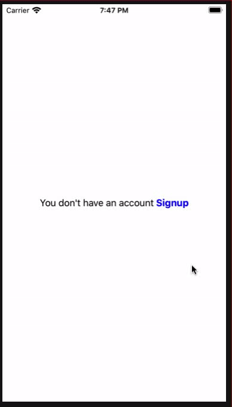

# ASAttributedLabel

[](https://travis-ci.org/amitpstu1@gmail.com/ASAttributedLabel)
[](https://cocoapods.org/pods/ASAttributedLabel)
[](https://cocoapods.org/pods/ASAttributedLabel)
[](https://cocoapods.org/pods/ASAttributedLabel)

Screenshots
---------


## Example

```swift

import ASAttributedLabel

@IBOutlet weak var detailsLabel: ASAttributedLabel!

private var attributes = [
    ASAttribute(value: "You don't have an account ", type: .defaultAttr),
    ASAttribute(value: "Signup", type: .markeAttr),
    ASAttribute(value: "", attrs: [.font: UIFont.systemFont(ofSize: 16, weight: .black), .foregroundColor: UIColor.blue] as [NSAttributedString.Key : Any]),
]


detailsLabel
.setAttributes(attributes)
.setEvent { [weak self] (attributeLabelIndex, attributeIndex, attribute) in
    if let value = attribute.value, value == "Signup" {
        print("value: \(value)")
        let alert = UIAlertController(title: "Alert", message: value, preferredStyle: UIAlertControllerStyle.alert)
        alert.addAction(UIAlertAction(title: "Ok", style: UIAlertActionStyle.default, handler: nil))
        self?.present(alert, animated: true, completion: nil)
    }}
```


## Import Statement

```swift

import ASAttributedLabel

```

## Initialize Outlet

```swift

@IBOutlet weak var detailsLabel: ASAttributedLabel!

```

## ASAttribute Array

```swift

private var attributes = [
    ASAttribute(value: "You don't have an account ", type: .defaultAttr),
    ASAttribute(value: "Signup", type: .markeAttr),
    ASAttribute(value: "", attrs: [.font: UIFont.systemFont(ofSize: 16, weight: .black), .foregroundColor: UIColor.blue] as [NSAttributedString.Key : Any]),
]

```

## Set ASAttribute and Event

```swift

detailsLabel
.setAttributes(attributes)
.setEvent { [weak self] (attributeLabelIndex, attributeIndex, attribute) in
    if let value = attribute.value, value == "Signup" {
        print("value: \(value)")
        let alert = UIAlertController(title: "Alert", message: value, preferredStyle: UIAlertControllerStyle.alert)
        alert.addAction(UIAlertAction(title: "Ok", style: UIAlertActionStyle.default, handler: nil))
        self?.present(alert, animated: true, completion: nil)
    }}
    
```

## For Multiple Event

```swift

// use 'setEvents'
    

## Requirements

## Installation

ASAttributedLabel is available through [CocoaPods](https://cocoapods.org). To install
it, simply add the following line to your Podfile:

```ruby
pod 'ASAttributedLabel'
```

## Author

amitpstu1@gmail.com, amitpstu1@gmail.com

## License

ASAttributedLabel is available under the MIT license. See the LICENSE file for more info.
